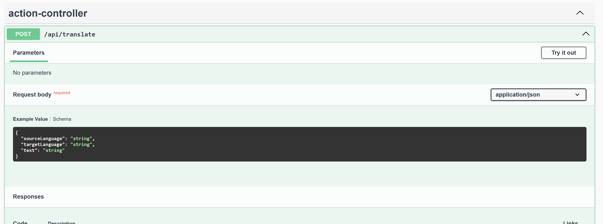

# Лабораторная работа Java-разработчик
# Как запустить? 
## Для начала вам нужно скачать Docker. Если у вас Windows, обязательно должна быть включена виртуализация. Обязательно откройте приложение Docker.
Далее в командой строке переход в папке с проектом\
Затем прописываем команды
```
docker-compose build
```
После того как билд готов
```
docker-compose up
```

Теперь переходим по этой ссылке

http://localhost:8080/swagger-ui/index.html

## Как делать запрос POST

sourceLanguage - язык исходного текста\
targetLanguage - язык выходного текста\
Жмем на кнопку Try it out, заполняем данные и нажимаем Execute

### Обратите внимание. 
Я использую переводчик DeepL. В подписке DeepL API FREE нет поддержки перевода с русского языка на другой язык.\
https://developers.deepl.com/docs/api-reference/languages - доступные языки
