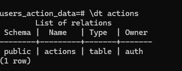

# Гайд на тот случай, если вы случайно влезли в работу контейнера бд и теперь сервер не видит таблицу

В проекте предусмотренна миграция базы данных. Использую я для этого liquibase.\
Вдруг, код не создал таблицу(такое впринципе не возможно но все же) или вы случайно удалили ее руками. LiquiBase сохраняет у себя в логах информацию, что таблица создана и не проверяет, присутствует ли она на самом деле.

Первое что можно сделать, перейти в контейнер с Базой Данных и почистить логи.
Для этого, нужно открыть консоль в которой будет открыт проект. Далее вписать вот такую команду
```
docker exec -it db_posgresql psql -U auth -d users_action_data

```

После этого вы попадете в консоль базы данных. В ней вы вводите вот этот запрос
```
DELETE FROM public.databasechangelog WHERE id = 'create-table' AND author = 'Danial';
```
#### Мы удалили записи о миграции для таблицы action. Теперь осталось перезапустить приложение для применение миграций
Вот команда для перезапуска
```
docker-compose restart
```

## Если вдруг не помогло или помогло и вы ходите удостовериться во всем и сделать все наверняка

### Тут мы будем обновлять контейнеры докера.

#### 1 Очиста и перезапуск Docker контейнеров.
```
docker-compose down -v
docker-compose up --build
```
#### 2 Полное удаление базы данных
```
docker-compose down -v
docker volume rm $(docker volume ls -qf dangling=true)
docker-compose up --build
```
Таким образом мы убеждаемся, что база данных полностью очищена перед запуском миграций.
#### 3 проверка состояния базы данных
Подключаемся в БД
```
docker exec -it db_posgresql psql -U auth -d users_action_data
```
И проверяем, создалась ли таблица
```
\dt actions
```

Если вы увидели данную картину, то все хорошо, приложение будет работать


## Надеюсь гайд вам помог и программа сервера стабильно работает)


